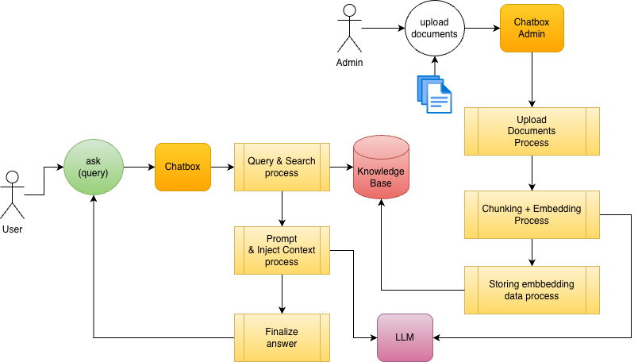
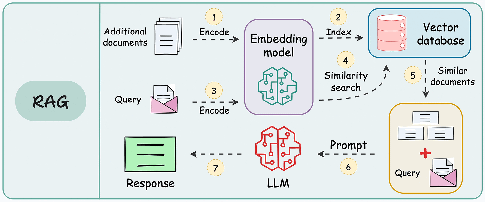
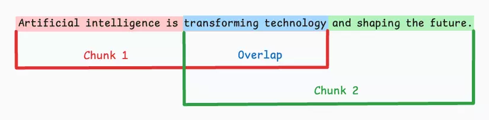
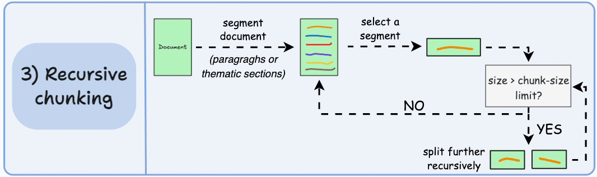
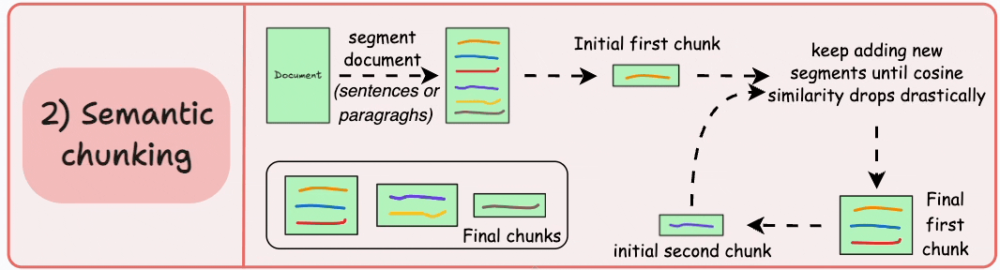
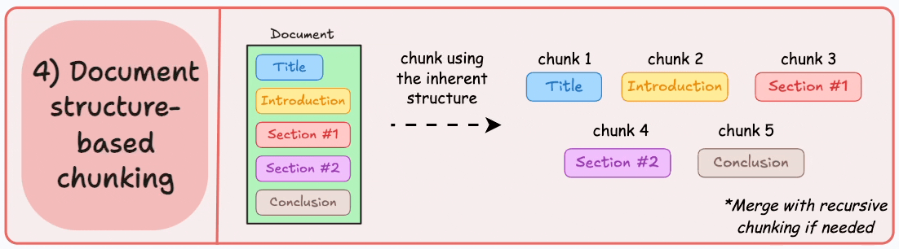
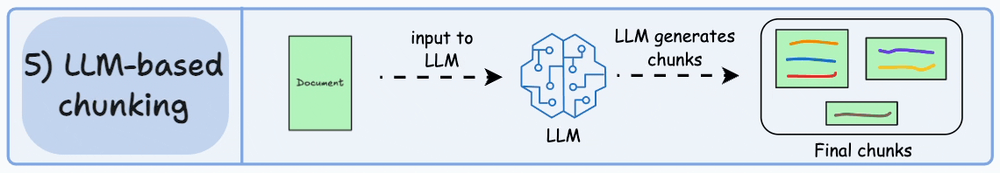
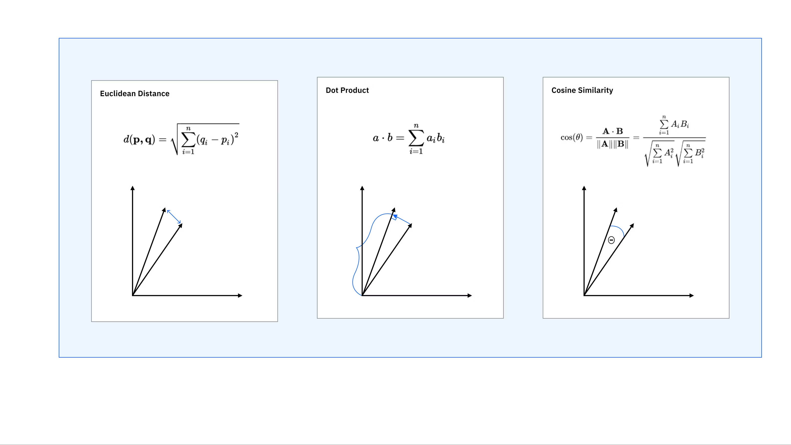

# Build chat with PDF - RAG basic

1. Output

- Upload PDF
- Chunk + embbedding
- Store vector DB
- Chat -> response based on document

2. Structure

```
PDF → chunk → embedding → vector DB
```

```
User -> query -> embedding -> search -> inject context -> LLM -> answer
```

3. Stack

- Python (AI Service)
- Postgres + pgvector (vector DB)
- Gemini : LLM + Embedding

## System overview





## Concepts

1. RAG Chunking

- Splits large documents into smaller, semantically coherent segments to improve search accuracy and fit within LLM context windows.

| LLM Model                  | Context Window Size | Min Chunk Size | Max Chunk Size |
| -------------------------- | ------------------- | -------------- | -------------- |
| Magic.dev LTM-2-Mini       | 100,000,000 tokens  | 32,000 tokens  | 128,000 tokens |
| Llama 4 Scout (Meta)       | 10,000,000 tokens   | 8,000 tokens   | 32,000 tokens  |
| Gemini 3 Pro               | 2,000,000 tokens    | 4,000 tokens   | 32,000 tokens  |
| Claude 4.6 (Opus/Sonnet)   | 1,000,000 tokens    | 4,000 tokens   | 24,000 tokens  |
| GPT-5.4 (OpenAI)           | 1,000,000 tokens    | 4,000 tokens   | 16,000 tokens  |
| Gemini 3 Flash             | 1,000,000 tokens    | 2,000 tokens   | 8,000 tokens   |
| Qwen 3.5 / Mistral Large 3 | 256,000 tokens      | 2,000 tokens   | 8,000 tokens   |
| Kimi K2.5 (Moonshot AI)    | 256,000 tokens      | 1,000 tokens   | 4,000 tokens   |
| GPT-4o / DeepSeek R1       | 128,000 tokens      | 512 tokens     | 2,048 tokens   |

- It is a critical preprocessing step that maximizes retriever precision and reduces computational costs.

- Common strategies include fixed-size, recursive, and semantic splitting, often with an overlap of 50-100 tokens to preserve context between chunks

**Fixed-Size Chunking**: Divides text into fixed token lengths (e.g., 512 tokens) with optional overlap. Simple but can break sentences.



**Recursive Chunking**: Hierarchically splits text using separators (paragraphs, sentences, words) until reaching the desired size, preserving structure.



**Semantic Chunking**: Uses embedding models to detect semantic shifts, ensuring each chunk contains a coherent, independent idea.



**Document-Based Chunking**: Utilizes markdown headers (H1, H2) or structured, semantic breaks to maintain context in structured data.



**LLM-based Chunking**: This advanced technique uses a Language Model (LLM) to generate chunks. The LLM processes the text and generates semantically isolated sentences or propositions that can stand alone. While this method is highly accurate, it is also the most computationally demanding.



| Strategy                | Speed     | Cost     | Accuracy (Semantic Coherence) | Complexity | Best Use Cases                                                                |
| ----------------------- | --------- | -------- | ----------------------------- | ---------- | ----------------------------------------------------------------------------- |
| Fixed-Size Chunking     | Very Fast | Very Low | Low                           | Very Low   | Simple RAG, logs, large-scale ingestion, baseline systems                     |
| Recursive Chunking      | Fast      | Low      | Medium                        | Low        | General RAG pipelines, documents with paragraphs, balanced performance        |
| Semantic Chunking       | Medium    | Medium   | High                          | Medium     | Knowledge bases, QA systems, content-heavy apps where meaning matters         |
| Document-Based Chunking | Fast      | Low      | High (if well-structured)     | Low–Medium | Markdown, docs, APIs, Notion/wiki systems, structured enterprise data         |
| LLM-based Chunking      | Slow      | High     | Very High                     | High       | High-end RAG, legal/medical docs, research systems, agent memory optimization |

2. Tokens in AI

- The fundamental units of text or data—such as words, parts of words, or punctuation—that Large Language Models (LLMs) process to understand and generate language.

- Typically, one token equals roughly 0.75 English words, with 1,000 tokens equaling about 750 words. They define context windows (memory limit) and determine costs

Two popular libs, you can use to calculate tokens

- https://github.com/huggingface/tokenizers
- https://github.com/openai/tiktoken

3. Vector embeddings

- Numerical representations of data—such as text, images, or audio—converted into arrays of numbers that machine learning models can understand.
- Data objects are mapped into a high-dimensional vector space, where distance represents relationship, using algorithms like Word2Vec, BERT, or neural networks.
- By transforming unstructured data into meaningful vector space, machines can identify patterns and similarities far beyond simple keyword matching.
- Common types include word embeddings (individual words), sentence/document embeddings (contextual meaning), image embeddings (visual features), and multimodal embeddings (combining text/images)

- https://developers.openai.com/api/docs/guides/embeddings
- https://ai.google.dev/gemini-api/docs/embeddings
- https://www.ibm.com/think/topics/vector-embedding

**Compare vector embeddings**

- Euclidean → measures distance
- Cosine → measures angle (meaning)
- Dot product → measures alignment + magnitude

| Scenario                                     | Best Choice                                        |
| -------------------------------------------- | -------------------------------------------------- |
| Semantic search (RAG, LLM embeddings)        | ✅ Cosine Similarity                               |
| High-performance vector DB (FAISS, pgvector) | ✅ Dot Product (often normalized → becomes cosine) |
| Numeric / physical features                  | ✅ Euclidean                                       |

| Method             | Algorithm (Formula)             | Speed     | Accuracy (Semantic) | Sensitivity to Magnitude | Best Use Cases                                                       |
| ------------------ | ------------------------------- | --------- | ------------------- | ------------------------ | -------------------------------------------------------------------- |
| Euclidean Distance | √Σ(ai - bi)²                    | Medium    | Medium              | High                     | Physical data (distance, size, counts), clustering (KNN, K-means)    |
| Cosine Similarity  | (A · B) / \|\|A\|\| · \|\|B\|\| | Fast      | High                | Low                      | NLP, embeddings, semantic search, RAG                                |
| Dot Product        | Σ(ai × bi)                      | Very Fast | Medium–High         | High                     | Ranking (when magnitude matters), recommendation systems, ANN search |



Normalizing vectors = converting a vector to unit length (magnitude = 1) so comparisons focus on direction (meaning) instead of size.

4. Inject Context

Document
→ split into text chunks
→ create embedding for each chunk
→ store: {chunk_text, embedding, metadata(source, title, section, page, chunk_id)}

User question
→ create query embedding
→ search vector DB
→ get top-k matching chunks
→ send the chunk TEXT + user question to LLM
→ LLM answers

5. Prompt in AI

- A prompt in AI is the input—text, image, or code—given to a model to guide its response. Effective prompts are specific, provide context, and act as instructions to generate relevant content, a process known as prompt engineering. Good prompts define tasks, constraints, and personas to ensure high-quality, actionable outputs

| Element            | Think of it as      | Role in Prompt                   | Primary Effect on Model               | Impact Level   | When to Use                                                | Risk if Misused                              |
| ------------------ | ------------------- | -------------------------------- | ------------------------------------- | -------------- | ---------------------------------------------------------- | -------------------------------------------- |
| Goal / Task        | What to do          | Defines what the AI should do    | Narrows objective (intent alignment)  | 🔥🔥🔥 High    | Always — summarizing, analyzing, generating, etc.          | Wrong task → completely wrong output         |
| Context            | What to know        | Provides background / knowledge  | Grounds answer, reduces hallucination | 🔥🔥 Medium    | RAG, domain-specific tasks, real-world data                | Too much → noise, too little → hallucination |
| Persona            | How to behave       | Sets role / expertise / tone     | Shapes reasoning style + voice        | 🔥 Low–Medium  | UX writing, marketing, expert simulation                   | Over-specific → bias or unnatural tone       |
| Constraints/Format | How to respond      | Defines structure and limits     | Controls output shape + readability   | 🔥🔥 Medium    | APIs, automation, UI rendering, structured outputs         | Too strict → rigid or incomplete answers     |
| Few-shot Examples  | Show me exactly how | Shows examples of desired output | Teaches pattern + format directly     | 🔥🔥🔥 Highest | Complex tasks, consistent formatting, classification tasks | Bad examples → model learns wrong pattern    |

## Practice Time

## References

- https://weaviate.io/blog/chunking-strategies-for-rag
- https://viblo.asia/p/toi-uu-hoa-rag-kham-pha-5-chien-luoc-chunking-hieu-qua-ban-can-biet-EvbLbPGW4nk
